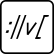

# MobX State Tree Router <!-- omit in toc -->

_State-based router for React and MobX State Tree_

[](https://www.npmjs.com/package/mobx-state-tree-router)

- [Inspiration](#inspiration)
- [Installation](#installation)
- [Quick Start](#quick-start)
- [Features](#features)
  - [React components](#react-components)
  - [MobX State Tree models](#mobx-state-tree-models)
  - [Browser url matching and history binding](#browser-url-matching-and-history-binding)
  - [Centralized view definitions](#centralized-view-definitions)
  - [Route cycle hooks](#route-cycle-hooks)
- [Known Issues](#known-issues)

## Inspiration

* [How to decouple state and UI (a.k.a. you don’t need componentWillMount)](https://hackernoon.com/how-to-decouple-state-and-ui-a-k-a-you-dont-need-componentwillmount-cc90b787aa37)
* [MobX Router](https://github.com/kitze/mobx-router)

## Installation

Peer dependencies: `react react-dom mobx mobx-react mobx-state-tree`

NPM: `npm install --save mobx-state-tree-router`

Yarn: `yarn add mobx-state-tree-router`

## Quick Start

__index.js__
```javascript
import React from 'react';
import ReactDOM from 'react-dom';
import { RouterStore, View, startRouter, StateRouter, Link } from 'mobx-state-tree-router';

const views = {
  home: View.create({
    name: 'home',
    path: '/',
    component: <div>Home page</div>
  }),
  about: View.create({
    name: 'about',
    path: '/about',
    component: <div>About page</div>
  })
};

const router = RouterStore.create({
  views: views
});

startRouter(router);

ReactDOM.render((
  <div>
    <Link router={router} view={views.home}>Home</Link>
    <Link router={router} view={views.about}>About</Link>
    <StateRouter router={router} />
  </div>
), document.getElementById('root'));
```

## Features

### React components

* `<StateRouter router loading />`
  * renders the appropriate component for the `router`'s `currentView`
  * `currentView` can be set by calling `router.setView(view, params)` directly, or using a `Link` component
  * props can be set for the rendered component by calling `router.setProps(props)`
  * a component can be passed into the `loading` prop to display a loading indicator (e.g. ajax spinner)
* `<Link router view></Link>`
  * renders an `<a href></a>` element with `href` set to the result of `view.formatUrl(params)`

### MobX State Tree models

* `RouterStore`
  * exposes the available `routes` based on the `views`
  * manages the `currentUrl` based on the `currentView` and `params`
  * `setView(view, params)` can be called to change the route
  * `setProps(props)` can be called to pass props to the `currentView`'s rendered component
* `View`
  * defines a `name`, `route`, `component` to render
  * defines optional change route `hooks`:
    * `beforeExit(self, params)`
    * `beforeEnter(self, params)`
    * `onExit(self, params)`
    * `onEnter(self, params)`
  * `formatUrl(params)` can be called to get the url for this `view` given the `params` passed

### Browser url matching and history binding

`startRouter(router)` binds the router to the browser's history object to update the url or parse a url change and set the appropriate view.

### Centralized view definitions

Views and their route cycle hooks (data fetching and business logic) can be defined in one centralized location:

__views.js__
```javascript
import { View } from 'mobx-state-tree-router';
import Home from 'components/Home';
import ItemList from 'components/ItemList';
import Item from 'components/Item';
export const views = {
  home: View.create({
    name: 'home',
    path: '/',
    component: <Home />
  }),
  items: View.create({
    name: 'items',
    path: '/items',
    component: <ItemList />
    hooks: {
      async beforeEnter(self) {
        await self.root.itemStore.loadItems();
      }
    }
  }),
  item: View.create({
    name: 'item',
    path: '/item/:itemId',
    component: <Item />
    hooks: {
      async beforeEnter(self, params) {
        self.router.setProps({ itemId: params.itemId });
        await self.root.itemStore.loadItem(params.itemId);
      }
    }
  })
};
```

### Route cycle hooks

These hooks provide a way to run some code during a route change. They can be synchronous or asynchronous. The route change process is as follows:

* `router.setView` called
  * `router.isLoading` set to `true`
* old view `beforeExit(self, params)`
  * returning `false` will cancel the route change
* new view `beforeEnter(self, params)`
  * returning `false` will cancel the route change
* route is updated and rendered
  * `router.isLoading` set to `false`
* old view `onExit(self, params)`
* new view `onEnter(self, params)`

## Known Issues

* `formatUrl` doesn't properly handle paths with catch-all `*`
  * current workaround is to use `setView` in the `beforeEnter` hook of the catch-all to redirect to another view
* query parameters are not handled
